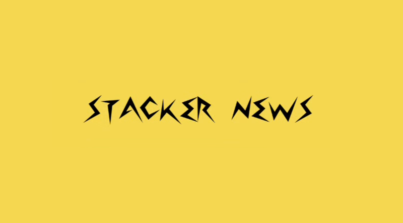

<!--
**R3DRUN3/R3DRUN3** is a ✨ _special_ ✨ repository because its `README.md` (this file) appears on your GitHub profile.

Here are some ideas to get you started:

- 🔭 I’m currently working on ...
- 🌱 I’m currently learning ...
- 👯 I’m looking to collaborate on ...
- 🤔 I’m looking for help with ...
- 💬 Ask me about ...
- 📫 How to reach me: ...
- 😄 Pronouns: ...
- ⚡ Fun fact: ...

  
  
  

-->

# About me ✍️
- **Forecaster**
- **Open Source Contributor**
- **Security and Automation Engineer**
- 

in the end just a collection of quantum bits,
 
constantly phasing between cyberspace and meatspace.
 
 

  

 

 

## 💁 Socials

  

 

  

 

  

  
 
 

I operate and maintain my own instance of a full ₿itcoin and Lightning⚡ node!  
If you'd like to buy me a ☕ you can send some *sats* to me@ln.stackzoo.io. 😊

 

## 🖥️ Technical Stack ⚡

 

 
 

 

 

 

 
 

 
 

 
 

## 📰 Articles 🖊️  
Between one clock cycle and another, I dedicate time to crafting professional articles on various technological topics.  
Noteworthy among them are the following articles published by the **Cloud Native Computing Foundation**:

- [Codebreaking clouds: hacking cloud native environments through VAPT mastery](https://www.cncf.io/blog/2023/12/13/codebreaking-clouds-hacking-cloud-native-environments-through-vapt-mastery/)
- [Secure your Kubernetes environment with OPA and Gatekeeper](https://www.cncf.io/blog/2023/10/09/secure-your-kubernetes-environment-with-opa-and-gatekeeper/)
- [Supply chain security framework: S2C2F](https://www.cncf.io/blog/2023/08/04/supply-chain-security-framework-s2c2f/)  

 

## 📈 Stats 📉 
<!--

-->

 

 

## Recent Activities on GitHub

<!--START_SECTION:activity-->
1. 💪 Opened PR [#503](https://github.com/kudobuilder/kuttl/pull/503) in [kudobuilder/kuttl](https://github.com/kudobuilder/kuttl)
2. 💪 Opened PR [#21](https://github.com/project-copacetic/copa-action/pull/21) in [project-copacetic/copa-action](https://github.com/project-copacetic/copa-action)
3. 💪 Opened PR [#86](https://github.com/bcongdon/awesome-lightning-network/pull/86) in [bcongdon/awesome-lightning-network](https://github.com/bcongdon/awesome-lightning-network)
4. 🎉 Merged PR [#3](https://github.com/R3DRUN3/gate/pull/3) in [R3DRUN3/gate](https://github.com/R3DRUN3/gate)
5. 💪 Opened PR [#198](https://github.com/getAlby/nostr-wallet-connect/pull/198) in [getAlby/nostr-wallet-connect](https://github.com/getAlby/nostr-wallet-connect)
<!--END_SECTION:activity-->

 

## ✅ Contributions Graph ✅

