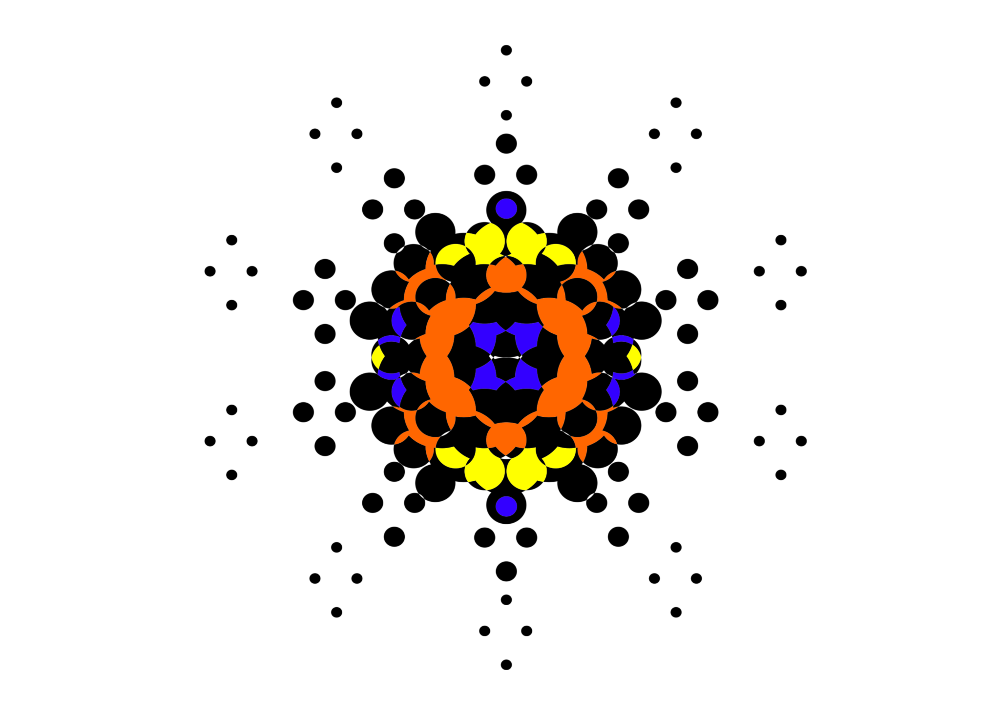

<!--
**R3DRUN3/R3DRUN3** is a ✨ _special_ ✨ repository because its `README.md` (this file) appears on your GitHub profile.

Here are some ideas to get you started:

- 🔭 I’m currently working on ...
- 🌱 I’m currently learning ...
- 👯 I’m looking to collaborate on ...
- 🤔 I’m looking for help with ...
- 💬 Ask me about ...
- 📫 How to reach me: ...
- 😄 Pronouns: ...
- ⚡ Fun fact: ...

  
  
  

-->

# About ᚱᛊᚧᚱVᚺᛊ  ✍️  

- **Security & Automation Engineer** 🔐🛡️
- **Hacker/Red Teamer 🏴‍☠️🔴**    
- **Open Source Contributor** 👨‍💻 ✅

in the end just a collection of quantum bits,
 
constantly phasing between cyberspace and meatspace.
 
 

  

 

 
 

## 💁 Socials

  

 

  

 
 

## 🖥️ Technical Stack ⚡

 

 
 

![](https://img.shields.io/badge/Tool-nmap-azure.svg?logo=data:image/svg%2bxml;base64,iVBORw0KGgoAAAANSUhEUgAAAEAAAABACAMAAACdt4HsAAAABGdBTUEAALGPC/xhBQAAAAFzUkdCAK7OHOkAAAAgY0hSTQAAeiYAAICEAAD6AAAAgOgAAHUwAADqYAAAOpgAABdwnLpRPAAAAoVQTFRFAAAAAAAAAAAAAAAAAAAAAAAAAAAAAAAAAAAAAAAAAAAAAAAAAAAAAAAAAAAAAAAAAAAAAAAAAAAAAAAAAAAAAAAAAAAAAAAAAAAAAAAAAAAAAAAAAAAAAAAAAAAAAAAAAAAAAAAAAAAAAAAAAAAAAAAAAAAAAAAAAAAAAAAAAAAAAAAAAAAAAAAAAAAAAAAAAAAAAAAAAAAAAAAAAAAAAAAAAAAAAAAAAAAAAAAAAAAAAAAAAAAAAAAAAAAAAAAAAAAAAAAAAAAAAAAAAAAAAAAAAAAAAAAAAAAAAAAAAAAAAAAAAAAAAAAAAAAAAAAAAAAAAAAAAAAAAAAAAAAAAAAAAAAAAAAAAAAAAAAAAAAAAAAAAAAAAAAAAAAAAAAAAAAAAAAAAAAAAAAAAAAAAAAAAAAAAAAAAAAAAAAAAAAAAAAAAAAAAAAAAAAAAAAAAAAAAAAAAAAAAAAAAAAAAAAAAAAAAAAAAAAAAAAAAAAAAAAAAAAAAAAAAAAAAAAAAAAAAAAAAAAAAAAAAAAAAAAAAAAAAAAAAAAAAAAAAAAAAAAAAAAAAAAAAAAAAAAAAAAAAAAAAAAAAAAAAAAAAAAAAAAAAAAAAAAAAAAAAAAAAAAAAAAAAAAAAAAAAAAAAAAAAAAAAAAAAAAAAAAAAAAAAAAAAAAAAAAAAAAAAAAAAAAAAAAAAAAAAAAAAAAAAAAAAAAAAAAAAAAAAAAAAAAAAAAAAAAAAAAAAAAAAAAAAAAAAAAAAAAAAAAAAAAAAAAAAAAAAAAAAAAAAAAAAAAAAAAAAAAAAAAAAAAAAAAAAAAAAAAAAAAAAAAAAAAAAAAAAAAAAAAAAAAAAAAAAAAA////p/uw/wAAANV0Uk5TAAEEBwgJDTBOfZacrbm9wLigkWU8FgMVT8Tr+v3z0aUjAiuEzfj83qFNDi6Q4v71v2ETHcVeC9C6SgU2rvf775gkD3fk4NfCleXUXzez6YknZuxCLIvo9gxv46g4EsbS2DWiUimpzlgKS+pwFBmC8S+HVtbwih6MaKR/XBiDr8HIhRt7OrdTn4Yapz+Bq5JxQ8Npl8lMy5vZQO4fpqqdJXqj7eewEUTKsvJbz/SIzL4tbtzVNI0GUV2x4Z5QgBdaMbSa5tpJHGd4V2wo39NtfvlUvKw7OzJmTwAAAAFiS0dE1ue1aqkAAAAJcEhZcwAADsQAAA7EAZUrDhsAAANNSURBVFjDY2AYBaNgFIwCIgAjEzMLKyszIzla2dg5OLm4eXj5+PkFBIWERUTFSNEtLsElKSV9FQFkZOXkhRWINENRSVlF9SomUFPX0NQiQru2jq7eVRxA38DQiIB+Y2Xdq/iAtIkpPleYGZrLXCUAVC0srXCFnbWNLVSVnh0Wy2E+s3dwxKrfydkFptZVyA3TAHcPTxjTy5sV03ofX1i8+fkHBGKJhqDgkNAwKDtcA90REZFRMLnoGMXYOCjHTk49PgEWLPJWiolJslCOeTITsv6UVKiVemnpGQwMmdCwyMrOCfXOzcuH8MIKGBhYOCSh5tkX5sC1MxUVQ80tKS0DCZRDA7yCga2yillMGRJ8MtUguRpOqD9kBNhhoVdbArXeBBJDTHUQfr1WrJBbQ6NZkxeE3wxJai2tUEcktCmCBIza1aCO6uiEmMjKDxHo6u7ptemz6J8wEcJ3gNqY0+wHDddJwIAwmwwxT2/KVFgCgRkwbbqJSRpffOvkGRD+ZHh6n+kO0ZQfqMiQHQ5mzuKajQgTHoiGOWKJcwXmpc43gxq4ABHqAQsXgYUWWzKA/ee5hG/hUoQ0NBAX+zAsW77CmkFiJSTUViFUTF0dzbcGnLwYQDEWv3b5mnVNCGlYNK5PYQitZhCBhuHiDQgVG2fp8nCCQmINwyZQfE9J2BwXuYUNJm0ES0ib85YIbYXlz4WwMNo2f7uNism6Bn2g4BSGHZuhGUfNfqJ/NzSvBsKStZ6MGiwp2weDpaxSsnfugkrLSO3ewMA4e0//wrgwiCkr3fduYQGqYuvFyAp6HcAoY9y3f24UOAL0wmdYrN1xgBlioVhESFuoCtjjelIHK2YrMgRMQTfARpyBxdrfHGy3XpZv5ARjtNKaMcfy0GGIX45MP8q2gQ+lYLOrPDb7+MEgiLz5iQMsWEsEpgJlV4g2/bi8k/NmIfRncZ8S3AQJDbVpFZ24yzTF07WwUsV++Qx4wS4TdQbK1jt7roYBL1BknzzrKk7gcn42A0FgNXPnBeza86cfUCSsHwi09tdjMWJl6gRmorSDk+LFSldkM2RkVUq7WYnWDvaIY2ZF4xwLfn7+S5eF+quv5BDneDQgxszKysrCRI7WUTAKRsEIBAA9StzEw8Xy+gAAACV0RVh0ZGF0ZTpjcmVhdGUAMjAyMC0wMi0wN1QxNzoyODoxNSswMDowMLCEqVQAAAAldEVYdGRhdGU6bW9kaWZ5ADIwMjAtMDItMDdUMTc6Mjg6MTUrMDA6MDDB2RHoAAAARnRFWHRzb2Z0d2FyZQBJbWFnZU1hZ2ljayA2LjcuOC05IDIwMTktMDItMDEgUTE2IGh0dHA6Ly93d3cuaW1hZ2VtYWdpY2sub3JnQXviyAAAABh0RVh0VGh1bWI6OkRvY3VtZW50OjpQYWdlcwAxp/+7LwAAABh0RVh0VGh1bWI6OkltYWdlOjpoZWlnaHQANTEywNBQUQAAABd0RVh0VGh1bWI6OkltYWdlOjpXaWR0aAA1MTIcfAPcAAAAGXRFWHRUaHVtYjo6TWltZXR5cGUAaW1hZ2UvcG5nP7JWTgAAABd0RVh0VGh1bWI6Ok1UaW1lADE1ODEwOTY0OTXAyokQAAAAE3RFWHRUaHVtYjo6U2l6ZQAxMi4zS0JCzRDEXAAAAEB0RVh0VGh1bWI6OlVSSQBmaWxlOi8vLi91cGxvYWRzLzU2L3NaenQxS3MvMjE0OC9ubWFwX2ljb25fMTMyMTUyLnBuZ6x8FoUAAAAASUVORK5CYII=)

![](https://img.shields.io/badge/Tool-nuclei-black.svg?logo=data:image/jpeg;base64,/9j/4AAQSkZJRgABAQAAAQABAAD/4QAqRXhpZgAASUkqAAgAAAABADEBAgAHAAAAGgAAAAAAAABQaWNhc2EAAP/bAEMAAgEBAgEBAgICAgICAgIDBQMDAwMDBgQEAwUHBgcHBwYHBwgJCwkICAoIBwcKDQoKCwwMDAwHCQ4PDQwOCwwMDP/bAEMBAgICAwMDBgMDBgwIBwgMDAwMDAwMDAwMDAwMDAwMDAwMDAwMDAwMDAwMDAwMDAwMDAwMDAwMDAwMDAwMDAwMDP/AABEIAC0ALQMBIgACEQEDEQH/xAAcAAABBQEBAQAAAAAAAAAAAAAJAAECBwgKBQb/xAAuEAABAwMEAQIFAwUAAAAAAAACAQMEBQYHAAgREgkTIQoUIjFBFRZCMlFhYnH/xAAXAQEBAQEAAAAAAAAAAAAAAAAAAQID/8QAGREBAQADAQAAAAAAAAAAAAAAAAEREiEx/9oADAMBAAIRAxEAPwAEelpa0Nhfxg5Zz7tCqearZplMm2tCu2DZMOEU306rXapLdZZbZhsdeHeHJDIlyYr9RKiKgGo9BnlE50/VU/C6Ottp+H7wVt9qMWyMk2pk7dBntqExOuS1rGmDTbcspHw7stTJ7j8ZsHDHsoo5I9V0U7jHEFQl9ref4atpWMsRVav33gfclttiU6G7KW5KFNC86REUR5H5gI8maTYqvCcuAyHKpy6PPOpsAHKnGlqZEHqEgERt8r1Ih6qo8+yqnK8Kqce3K8f3X76iScLqhk++uinwtBRI3jx2ANSkY/Q5uXbkdqZHx0/WRgXB8iJ/7dxHpz/IW+PfjXOtonngc33UluxLr2w5PtvIFfxpdE0LwpFfsqnSp9dxvVopNOJVmRjNuPA2240w76oAXpuN/UBg64OpYPit+nlk3N4Pu7NO3t2vvWIyuT69W63OpDTlPrtUKTJIgZdlgaEUX0vSVvogqTSth3JoQFNd+DndFNt7x33zky0r7yTceQ8HTSrOULGuetOVWgXharxmTpQmHlL5WQ1FbeMHW1QlejEDqONPCgtvh8bFi+QjcxHy3lzfzgGTbUWmRaY/Kp9Oh0m4H4kdTVAOGkjhZZdzRSUVVCVEFkREWks+j7YsUbAdte4C9MbUet48tjc3S6ThjF1JvKW9GqFwvy/UiSa2bUvh2NGdWUsgRfQCRuI46oNi802meAZHxBWym19jnkouGj2LHYhWHe1MiXjb8RhOGYTEz1EcZbT8NC+08oCn9IEA/wAdYo47omiL/FK5doWQfKQ5bNuTGJ9OxTaFKs4nmXEcFX2kdkOB2T2Ug+ZACT8EBIvui6HQH21qeCOrX2db28obCMs/vfE11y7SuI4qwX3m2GpDM2MRiasPNOiQONqQCvCpyiiioqKnOqo0kXjVBQWPi1NyiMtyJNoYLqFwNCgt11+1X0nAqfy+mUg8/wDERP8AGsOb1N+mWvIXk8Lty3eE66qnGbJiEyYAxBpjRKiq3HjtojbQrwnZUTsfVFIiVEXVRKSL+NLsifjUwIttIKeyImpqvTTKSrptUf/Z)

 

 

 

 

 

 

 

 

 

 
   

 
 

 
 

## 📰 Articles 🖊️  
Between clock cycles, I dedicate time to crafting professional articles on various technological topics (mostly related to security).  
Noteworthy among them are the following, with some having been published by the **Cloud Native Computing Foundation**:  

- [Exploiting the Matrix: Offensive Techniques for Attacking AI Models](https://www.neteye-blog.com/2024/08/exploiting-the-matrix-offensive-techniques-for-attacking-ai-models/)
- [Stay ahead of Cyber Threats: Redefining Security for a rapidly changing Digital World](https://www.neteye-blog.com/2025/01/stay-ahead-of-cyber-threats-redefining-security-for-a-rapidly-changing-digital-world/)
- [Inside the Red Team Toolbox: Linux Info-Gathering](https://www.neteye-blog.com/2025/01/inside-the-red-team-toolbox-linux-info-gathering/)
- [Building a Distributed DDoS Infrastructure for Red Teaming Campaigns](https://www.neteye-blog.com/2025/02/building-a-distributed-ddos-infrastructure-for-red-teaming-campaigns/)
- [Codebreaking clouds: hacking cloud native environments through VAPT mastery](https://www.cncf.io/blog/2023/12/13/codebreaking-clouds-hacking-cloud-native-environments-through-vapt-mastery/)
- [Anatomy of a CVE](https://www.cncf.io/blog/2024/02/13/anatomy-of-a-cve/)
- [Secure your Kubernetes environment with OPA and Gatekeeper](https://www.cncf.io/blog/2023/10/09/secure-your-kubernetes-environment-with-opa-and-gatekeeper/)
- [Supply chain security framework: S2C2F](https://www.cncf.io/blog/2023/08/04/supply-chain-security-framework-s2c2f/)  

 

  

 
 

## 📈 Stats 📉 
<!--

-->

 

 

## Recent Activities on GitHub

<!--START_SECTION:activity-->
1. 💪 Opened PR [#20](https://github.com/R3DRUN3/github-content-sync/pull/20) in [R3DRUN3/github-content-sync](https://github.com/R3DRUN3/github-content-sync)
2. ❌ Closed PR [#2050](https://github.com/btcsuite/btcd/pull/2050) in [btcsuite/btcd](https://github.com/btcsuite/btcd)
3. ❌ Closed PR [#72](https://github.com/jeffthibault/python-nostr/pull/72) in [jeffthibault/python-nostr](https://github.com/jeffthibault/python-nostr)
4. 💪 Opened PR [#15](https://github.com/R3DRUN3/github-content-sync/pull/15) in [R3DRUN3/github-content-sync](https://github.com/R3DRUN3/github-content-sync)
5. ❌ Closed PR [#2](https://github.com/R3DRUN3/vermilion/pull/2) in [R3DRUN3/vermilion](https://github.com/R3DRUN3/vermilion)
<!--END_SECTION:activity-->

 

## ✅ Contributions Graph ✅

